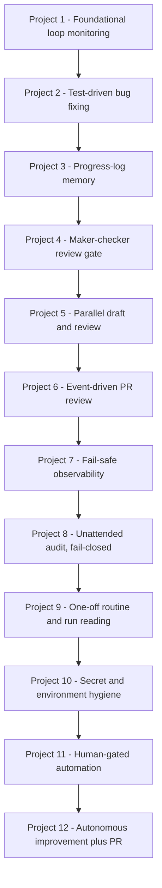

# Claude Loop Engineering Projects

A portfolio of twelve progressive loop-engineering exercises — from foundational loop monitoring to an autonomous, human-gated improvement workflow.



## Overview

This repository is a portfolio of **loop-engineering** exercises completed in
sequence (Project 1 through Project 12). Each project practices a different
aspect of building, observing, and safely operating autonomous or
semi-autonomous loops with an agent (Claude Code / OpenCode). The repository
itself is the source of truth: the descriptions below are based on each
project's own `README.md`, its source, its tests/run logs, and the Git history.
Where a project distinguishes *completed work* from *proposed / reviewed but not
merged* work, that distinction is preserved.

## Projects

### Project 1 — In-Session Loop Monitoring
- **Purpose:** Practice Claude Code's `/loop` feature to monitor a long-running
  background task hands-off.
- **Key implementation:** A simulated 3-minute task (`slow_task.sh`) writes
  `started.txt`` then `task_complete.txt`; `check_loop.sh` is invoked every 60s
  by `/loop`, tracks checks via `check_count.txt`, detects completion, and
  enforces a 15-check safety limit. A `monitoring_done.txt` state file turns
  later cron fires into harmless no-ops; termination is hybrid (Claude cancels
  actively, or manual `CronDelete`).
- **Engineering concepts:** recurring heartbeat execution, explicit completion
  signal, bounded stop condition, idempotent no-op after completion, hybrid
  manual/automatic termination.
- **Verification / results:** Demonstrated run detected completion around check
  4 (~3 min); timeout path at 15 checks is documented; the safety limit and
  state file prevent infinite looping.

### Project 2 — Test-Driven Bug-Fixing Loop
- **Purpose:** Start from deliberately broken code and fix it iteratively until
  the test suite passes — with the tests as the sole success criterion.
- **Key implementation:** `number_utils.py` ships three broken functions
  (`is_prime`, `dedupe_preserve_order`, `running_total`) plus a failing pytest
  suite. A fix loop runs `pytest`, reads the failures, applies one focused fix,
  and repeats up to a hard cap of 6 attempts. History is split into a failing
  phase and a fixes phase.
- **Engineering concepts:** test-driven loop, hard attempt cap, stop on a
  genuine pass (not on hitting the cap), separation of broken vs. fixed states
  in history.
- **Verification / results:** `3 passed`. The loop took 4 attempts (within the
  cap) and stopped because the suite genuinely passed. Two-phase history:
  `55b166c` (failing) → `7ae106b` (fixes).

### Project 3 — Scheduled Progress-Log Loop
- **Purpose:** Maintain a progress log that records only *new* information
  across runs.
- **Key implementation:** A scheduled loop reads `progress.md`, scans the repo
  (excluding all other `project-N` folders) for TODO comments, compares against
  previously logged entries, and appends a dated section containing only what is
  new.
- **Engineering concepts:** persistent memory across loop runs, de-duplication
  of prior findings, incremental logging.
- **Verification / results:** Tested by running repeatedly; later runs correctly
  omit TODOs already recorded, confirming prior findings are not repeated.

### Project 4 — Maker–Checker Fix Loop (OpenCode)
- **Purpose:** Prove a reviewer agent is not a rubber stamp — it must accept a
  real fix and reject a planted fake one.
- **Key implementation:** An implementer fixes a boundary bug in `src/cart.py`
  (`apply_discount` used `>` instead of `>=`, excluding a subtotal of exactly
  $100) inside an isolated git worktree. A separate reviewer grades the diff as
  PASS/FAIL; a PR opens only on PASS.
- **Engineering concepts:** maker–checker separation, isolated worktree,
  independent review gate, PR-only-on-pass, spec-vs-source correctness.
- **Verification / results:** Real fix (`>` → `>=`) graded **PASS**. A planted
  bad fix (editing the test's expected value instead of the source) graded
  **FAIL** — proving the reviewer distinguishes a real fix from a fake one.

### Project 5 — Parallel Fix-and-Review (Single Pass)
- **Purpose:** Draft multiple candidate fixes in parallel and review them.
- **Key implementation:** `fix-and-review.sh` reads `candidates.list`, creates
  an isolated git worktree per candidate, launches each fix script in the
  background (parallel), waits, then runs `reviewer.sh` (exit code = grade:
  0 = PASS, nonzero = FAIL) and prints a summary table. The sample `calc.py`
  carries three deliberate bugs; one candidate fixes all three (PASS), the
  others partially fix (FAIL). Deliberately a single pass — no heartbeat and no
  progress file.
- **Engineering concepts:** parallel drafting, isolated worktrees,
  exit-code-based grading, single-pass design (explicitly not a loop), and the
  lesson that a heartbeat without a persistent progress file is dangerous.
- **Verification / results:** Confirmed parallel drafting plus real test-based
  grading; the summary distinguishes PASS/FAIL candidates.

### Project 6 — Event-Driven GitHub PR Review Loop (OpenCode)
- **Purpose:** Make a repository review its own pull requests automatically.
- **Key implementation:** A GitHub Actions workflow (`opencode-review.yml`)
  triggers on `pull_request` (`opened`, `synchronize`, etc.) and runs OpenCode
  to post a review comment on the PR. `calculator.py` carries a planted bug
  (`max_value` returns the minimum due to an inverted comparison) that CI tests
  do not cover, so it must be caught by review.
- **Engineering concepts:** event-driven loop, PR activity as a heartbeat
  (`synchronize` re-triggers the review), automated code review as a gate,
  path-scoped workflow.
- **Verification / results:** Workflow configured to fire on PR open and on each
  `synchronize` push, posting the `max_value` fix (`v < result` → `v > result`)
  as a comment.

### Project 7 — Observable Scheduled Loop (Fails Safe, Needs Human)
- **Purpose:** A scheduled loop that is observable, cost-aware, bounded, and
  fails loudly.
- **Key implementation:** `loop.py` runs a beat every 3s, logs every event to
  `run.log` with ISO-8601 timestamps and a `FAILURE` reason, projects an
  estimated monthly cost from a configured token price model, and stops after
  `max_attempts = 3`. It is deliberately sabotaged (`prompt_file` points to a
  nonexistent file) and left unfixed.
- **Engineering concepts:** observability via structured logs, cost projection,
  hard safety limit, fail-safe ("NEEDS HUMAN"), diagnosable evidence.
- **Verification / results:** `verify.py` confirms `run.log` contains a
  timestamped `FAILURE`, `progress.md` contains `NEEDS HUMAN`, and the cost
  estimate is present. Final state: **NEEDS HUMAN**.

### Project 8 — Unattended Dependency-Audit Loop
- **Purpose:** Periodically audit a dependency manifest, propose safe updates in
  an isolated worktree, and verify them before any PR.
- **Key implementation:** A full loop-engineering system (`dep_audit/`) with six
  parts — **heartbeat** (bounded iterations/runtime), **worktree** (isolated
  copy/git worktree), **skill** (actionable vs forbidden + evidence), **maker**
  (proposes safe bumps, records evidence), **checker** (independently
  re-audits, blocks majors/secrets/over-limit, fail-closed), and **connector**
  (reports/opens PR; `FakeConnector` for tests, `GitHubConnector` for real use,
  dry-run safe). The spine orchestrates and fails closed.
- **Engineering concepts:** full fail-closed loop-engineering system,
  maker–checker, worktree isolation, budget guards (`max_iterations`,
  `max_runtime_seconds`, `max_changes_per_run`, `allow_major=false`,
  `dry_run=true`), observability (per-run JSON + markdown + `index.log`),
  dry-run safety.
- **Verification / results:** 33 unit tests pass; dry-run single run, bounded
  heartbeat, and detached smoke tests all pass. Per its README: implementation
  and automated verification are complete; the seven-day unattended dry-run
  real-world validation was described as **in progress / not yet declared fully
  complete** (no real PRs or pushes occurred).

### Project 9 — One-off Scheduled Routine & Reading Runs (A1, A3, A5)
- **Purpose:** Practice a one-off scheduled routine and the A5 lesson about
  reading runs.
- **Key implementation:** A routine (via `opencode run`, orchestrated by a
  one-off `Start-Sleep` shell timer — **not** a repeating schedule) summarizes
  yesterday's Git commits onto a `claude/summary` branch. Two runs were executed
  and their full transcripts read.
- **Engineering concepts:** one-off schedule (A3), loop/automation (A1), reading
  runs (A5), evidence via full transcripts rather than status columns.
- **Verification / results:** **Run 1 (success):** 19 commits from 2026-08-19
  summarized; `claude/summary` branch created; `SUMMARY.md` committed as
  `771f9b4`. **Run 2 (failure):** a broken v2 prompt required a missing input
  file; the agent reported failure and performed no further actions. Both
  sessions show a green "completed" status — demonstrating A5: a green session
  status alone cannot distinguish a successful task from a failed one.

### Project 10 — Secret Discovery (RUN 1)
- **Purpose:** Show that a gitignored local `.env` secret is unavailable to a
  fresh clone/cloud environment.
- **Key implementation:** `main.py` reads `DEMO_TOKEN` **only** from the process
  environment (`os.environ`), never from `.env` (which is gitignored) and never
  hardcoded. A run supplies the token via the environment.
- **Engineering concepts:** secret hygiene, environment-based configuration,
  never commit secrets.
- **Verification / results:** With the token exported, the program reports
  `[OK] ... found`; without it, `[FAIL] ... NOT present`. Establishes the RUN 1
  baseline (local secret present, program relies solely on the environment).

### Project 11 — Human-Gated Two-Routine Automation Loop
- **Purpose:** Build a human-gated automation loop with two routines and an
  explicit approval gate.
- **Key implementation:** **Routine A** (one-off) produces a reviewable draft on
  branch `a/draft-N` with `review_state = "pending"`. A **human approval gate**
  (`approve.py`) flips state to `approved`. **Routine B** is an HTTP API trigger
  (bearer-token protected) that performs a follow-up action *only* after both a
  valid token **and** `approved` state are present; it refuses (401/403)
  otherwise and never pushes. A state file (`loop_state.json`) records status;
  `unrestricted_push` is disabled; unused connectors were pruned to `local_http`.
- **Engineering concepts:** human gate, API trigger (not implicit chaining from
  A), explicit state file, harness limits (10 iterations / 20 minutes),
  evidence (transcript, commit, A6 checklist), controlled automation.
- **Verification / results:** End-to-end run produced commit `d70d7f0` from
  Routine B only after human approval; `b_transcript.log` records the event.
  Boundary tests and the A6 evidence checklist both pass (**PASS: 10, FAIL: 0**).
  No `git push` was performed.

### Project 12 — Capstone Improvement Loop
- **Purpose:** A second-order loop that reads a week of progress logs, detects
  failures/corrections that recur, and drafts the smallest *rules* change as a
  PR — never editing the guarded rules file directly — to be reviewed and
  merged by a human.
- **Key implementation:** `loop.py` analyzes logs dated after
  `last-processed-date` (2026-08-12) in `dreaming-state.md` and detects the
  recurring failure **`forgot to prefix branch with `claude/`** (count 4;
  run IDs `run-001`, `run-003`, `run-007`, `run-010`; dates 2026-08-13,
  2026-08-14, 2026-08-16, 2026-08-18; with verbatim CORRECTION evidence from the
  logs). It proposes **R7** (a guard requiring `claude/`-prefixed branches) and
  the deletion of **R6** (a deprecated rule with 0 positive usages across the 11
  processed runs). The loop writes the proposal artifacts
  (`analysis/proposal.md`, `analysis/rules-proposal.diff`,
  `analysis/proposed-rules.md`), creates a `claude/`-prefixed branch, commits
  the proposal, pushes, and opens a PR via the `gh` CLI. Only after the PR is
  created successfully does it advance `dreaming-state.md` (recording the PR
  number/URL) on that same branch. **The loop never modifies `rules/rules.md`;
  the proposed change was reviewed and merged when PR #4 was merged into `main`**
  (the human review/merge step). Safety gates preserved: evidence-first (a proposal
  requires `failure`, `run_ids`, `dates`, `count >= 2`, and non-empty
  `evidence`), exactly-one deletion, a no-reviewable-change guard (refuses an
  empty diff), and a `gh` availability check.
- **Engineering concepts:** second-order improvement, evidence-first gating,
  exactly-one deletion, no-reviewable-change safety, GitHub PR workflow,
  branch/commit isolation, and a human merge gate that was passed when PR #4 was
  reviewed and merged into `main`.
- **Verification / results:** The automated PR phase **completed and created PR
  #4** (`https://github.com/syedahafsabilal/claude-loop-engineering-projects/pull/4`),
  recorded on the PR branch's `dreaming-state.md` (`last-pr-number: 4`). PR #4
  was reviewed and **merged into `main`** (merge commit `97ac8e1`), completing
  the full workflow: analysis → `claude/` branch → proposal → push → PR #4 →
  human review → merge. On merge, `dreaming-state.md` was advanced to
  **2026-08-19** and records PR #4. The proposed rule change (R7 guard; R6
  deletion) was reviewed and merged as PR #4. The loop's test suite passes (27
  tests).

## Engineering Progression

The projects build toward the Project 12 capstone:

1. **Monitoring & bounds** (P1) — recurring execution with a completion signal
   and a hard stop.
2. **Test-driven fix loops** (P2) — the test suite is the sole success criterion.
3. **Memory across runs** (P3) — a log file prevents re-doing past work.
4. **Independent review + PR gate** (P4, P6) — a checker/reviewer gates
   progress; events can drive the loop.
5. **Parallel drafting & review** (P5) — fan-out candidates, grade each.
6. **Fail-safe observability** (P7) — loud, diagnosable failure and cost
   awareness.
7. **Full fail-closed system** (P8) — heartbeat, worktree isolation,
   maker–checker, connector, spine, budget guards.
8. **Reading runs & one-off routines** (P9) — status alone is insufficient;
   verify by reading evidence.
9. **Secrets hygiene** (P10) — environment over committed files.
10. **Human-gated automation** (P11) — explicit approval before consequential
    action; evidence-backed checklist.
11. **Second-order improvement + PR** (P12) — a loop that improves the
    project's own rules and ships the change as a PR for a human to merge.

## Repository Structure

```
(project root)
├── AGENTS.md                      # Repo-wide agent operating rules
├── .gitignore
├── .github/                      # GitHub workflows (e.g. PR review)
├── .claude/                      # Tool configuration
├── project-1/ … project-12/      # One folder per exercise
│   ├── README.md                 # Per-project documentation (source of truth)
│   ├── <source / scripts>        # Loop implementation or exercise artifacts
│   ├── tests/  or test_*.py      # Verification (pytest / unittest)
│   ├── progress / run logs       # Memory and evidence files
│   └── dreaming-state.md, rules/ # (Project 12) guarded state & rules
└── README.md                     # This document (root)
```

Each `project-N/` is meant to be self-contained; per `AGENTS.md`, work on a
given project stays inside its own folder.

## Verification

Verification is done per project and, where possible, with executable checks
rather than assertions:

- **Unit / functional tests:** pytest (P2, P4, P5, P6), `unittest`
  (P8: 33 tests; P11: boundary tests; P12: 27 tests), `verify.py` (P7).
- **Dry-runs:** P8 runs entirely in dry-run (no remote writes); P12's
  `--dry-run` analyzes and previews without Git/PR/state changes.
- **Maker–checker / review gates:** P4 (real fix PASS, planted fix FAIL),
  P6 (review catches the unseen bug), P5 (exit-code grading).
- **Evidence reading:** P9 reads full run transcripts to confirm success vs.
  failure despite identical green session status; P11's A6 checklist verifies
  evidence, not mere file existence.
- **Git history as proof:** commit messages and branch/PR state in the
  repository corroborate what each loop actually did (e.g. P12's PR #4 and
  advanced `dreaming-state`).

## Git/GitHub Workflow

Across the projects the repository demonstrates a consistent, safety-oriented
workflow:

- **Feature/loop branches:** `claude/…` (P9 summary; P12 improvement PR),
  `a/draft-N` (P11 drafts), `project-N-test` / `project-7-test` (P6/P7
  integration branches).
- **Commits:** small, single-purpose commits; the loop's proposal and
  state-update are separate commits on its own branch.
- **Pull requests:** opened by the loop or workflow (P4 on PASS, P6 on PR
  events, P12 after analysis) but **only as a proposal**; the loop never merges
  its own PR.
- **Isolation:** P4 and P8 perform changes in isolated worktrees so the main
  tree is untouched until review passes.

## Final Status

| Project | Status (based on repository evidence) |
|---------|----------------------------------------|
| 1 | Implemented & demonstrated: bounded in-session monitoring loop. |
| 2 | Complete: fix loop passes tests within the attempt cap. |
| 3 | Implemented & tested: de-duplicating progress-log loop. |
| 4 | Complete: maker–checker loop accepts real fix, rejects fake. |
| 5 | Implemented: parallel draft-and-review (single pass, by design). |
| 6 | Implemented: event-driven PR-review workflow with planted bug. |
| 7 | Implemented: observable, fail-safe loop ending in NEEDS HUMAN. |
| 8 | Implementation + automated verification complete; seven-day
|   | unattended dry-run validation described as in progress / not yet
|   | fully complete (no real PRs/pushes). |
| 9 | Complete: one-off routine run twice; A5 lesson demonstrated via
|   | transcripts (success `771f9b4` vs. failed run). |
| 10 | RUN 1 baseline complete: environment-only secret handling shown. |
| 11 | Complete: human-gated two-routine loop; A6 checklist 10/10 PASS;
|   | no push performed. |
| 12 | Implemented & executed end-to-end and **completed**: analysis →
|   | `claude/` branch → push → PR #4 → human review → **merged into `main`**
|   | (commit `97ac8e1`); `dreaming-state` advanced to 2026-08-19. The proposed
|   | R7/R6 rule change was reviewed and merged as PR #4. |

*This README documents what the repository actually contains and shows. Claims
about merges, PRs, and test results are grounded in the project READMEs, source,
run logs, and Git history present in this repository.*
